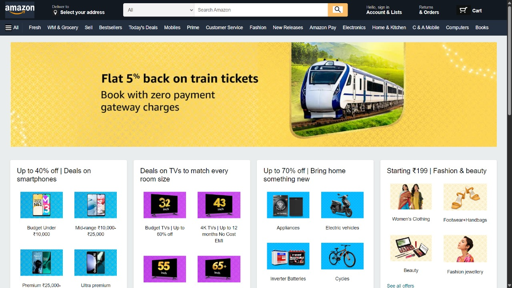
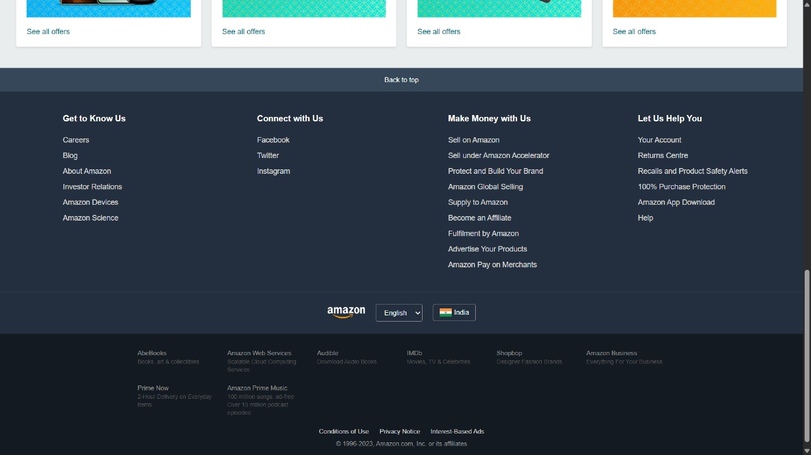

# Amazon Clone

A responsive Amazon.com clone built with HTML and CSS, featuring a modern UI that closely resembles the original Amazon website. This project demonstrates advanced CSS techniques including Flexbox, Grid, and responsive design principles.

## 📸 Project Screenshots

These screenshots showcase the complete interface of the Amazon clone project.

### Full Page View (Top Section)
<div align="center">
  
  <p><em>Top section of the Amazon clone, including navigation and hero banner.</em></p>
</div>

### Full Page View (Bottom Section)
<div align="center">
  
  <p><em>Bottom section of the Amazon clone, including product grids and footer.</em></p>
</div>

## 🛠️ Technologies Used

- HTML5
- CSS3
- Font Awesome Icons
- Responsive Design Principles
- CSS Flexbox and Grid
- CSS Media Queries
- CSS Transitions and Hover Effects

## 📋 Prerequisites

- A modern web browser (Chrome, Firefox, Safari, Edge)
- Basic understanding of HTML and CSS (for modifications)

## 🚀 Getting Started

1. Clone the repository:
```bash
https://github.com/Okay002/Amazon-Clone.git
```

2. Navigate to the project directory:
```bash
cd amazon-clone
```

3. Open `main.html` in your web browser to view the project.

## 📁 Project Structure

```
amazon-clone/
├── main.html           # Main HTML file containing the complete webpage structure
├── style.css           # Main stylesheet with all styling and responsive design
├── nav.html            # Navigation component for header section
├── Amazon-Emblem.jpg
├── phone1.jpg
├── tv1.jpg
└── ...
└── README.md           # Project documentation
```

## 🎯 Key Technical Features

### CSS Implementation
- Flexbox for navigation and layout
- CSS Grid for product sections
- Media queries for responsive design
- CSS transitions for smooth hover effects
- Box-shadow for depth and elevation
- Custom color scheme matching Amazon's palette

### Performance Optimizations
- Optimized images
- Efficient CSS selectors
- Minimal use of external resources
- Fast loading times

## 👏 Acknowledgments

- Design inspired by Amazon.com
- Icons provided by Font Awesome
- Images used for demonstration purposes only

